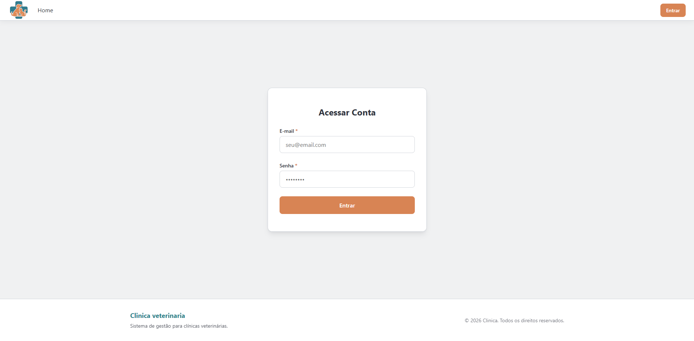
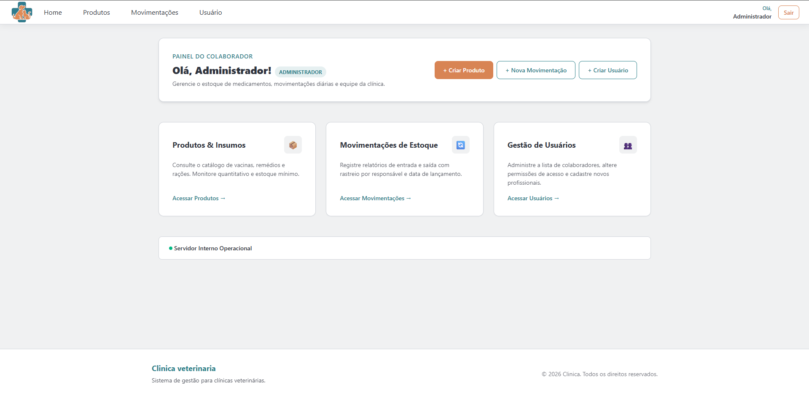
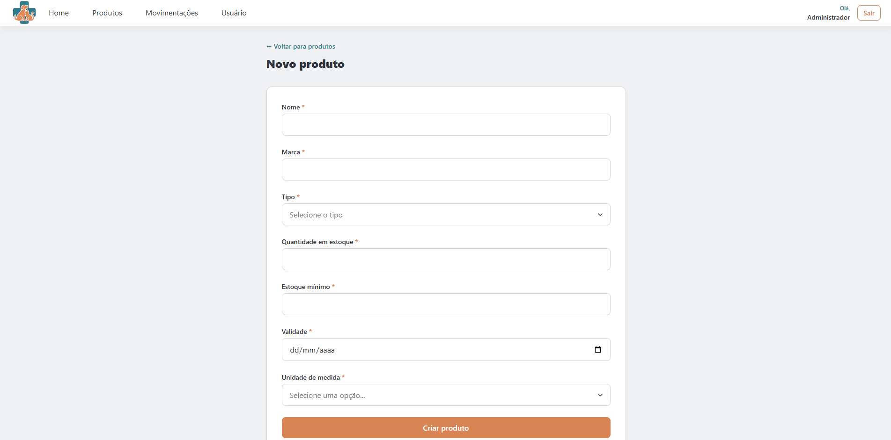
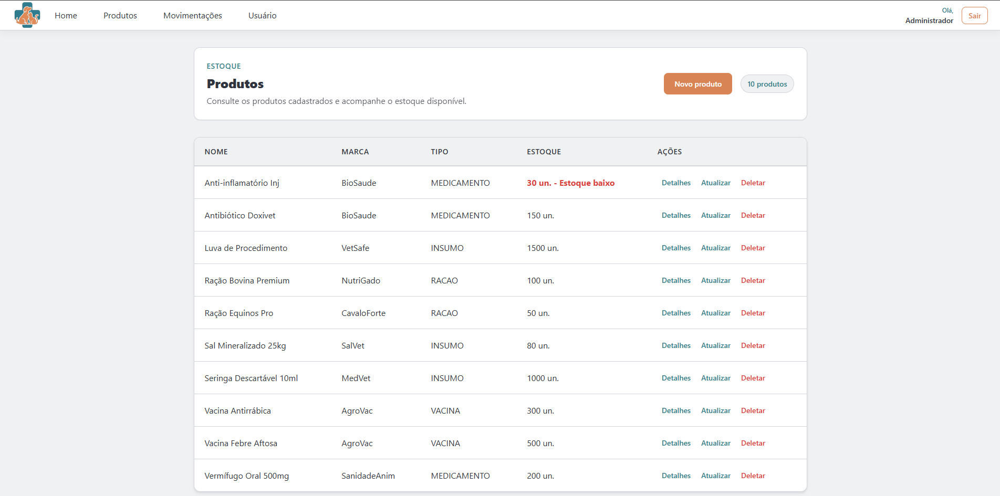

<div align="center">

# 🐾 VetStock — Sistema de Gestão de Estoque e Almoxarifado Veterinário

  <p align="center">
    <strong>Solução full-stack robusta para controle automatizado de almoxarifado, fracionamento de insumos e alertas de estoque mínimo em clínicas veterinárias e pet shops.</strong>
  </p>

  <p align="center">
    <a href="#-visão-geral-da-arquitetura">Arquitetura</a> •
    <a href="#-principais-funcionalidades">Funcionalidades</a> •
    <a href="#-tecnologias-utilizadas">Tecnologias</a> •
    <a href="#-como-executar-o-projeto">Como Executar</a> •
    <a href="./frontend/README.md">Frontend Doc</a> •
    <a href="./backend/README.md">Backend Doc</a>
  </p>

  <!-- Badges -->
  <p align="center">
    
    
    
    
    
    
    
    
    
  </p>

</div>

---

## 📌 Pitch do Projeto

Em estabelecimentos que integram **Pet Shop** e **Clínica Veterinária**, a gestão de almoxarifado enfrenta desafios críticos: perda financeira por produtos vencidos, desabastecimento de vacinas e medicamentos controlados de emergência, e a necessidade de controle fracionado de dosagens em mililitros ($ml$) e miligramas ($mg$).

O **VetStock** foi desenvolvido para solucionar estes problemas através de uma plataforma web moderna, segura e altamente intuitiva. O sistema permite o cadastro minucioso de produtos, monitoramento em tempo real de inventários com controle de estoque mínimo individualizável, registro auditável de movimentações (entradas/saídas com responsável e data) e autenticação de usuários via JWT.

---

## 📸 Demonstração / Telas da Aplicação

> ⚠️ *Substitua os links abaixo pelas capturas de tela ou GIFs da sua aplicação rodando.*

<div align="center">
  <table>
    <tr>
      <td align="center" width="50%">
        <strong>Autenticação & Login</strong><br/><br/>
        
      </td>
      <td align="center" width="50%">
        <strong>Painel Principal / Inventário</strong><br/><br/>
        
      </td>
    </tr>
    <tr>
      <td align="center" width="50%">
        <strong>Cadastro de Produtos & Validações</strong><br/><br/>
        
      </td>
      <td align="center" width="50%">
        <strong>Gestão de Estoque & Alerta Mínimo</strong><br/><br/>
        
      </td>
    </tr>
  </table>
</div>

---

## 🧱 Visão Geral da Arquitetura

O ecossistema é desacoplado e distribuído no modelo **Cliente-Servidor (SPA + RESTful API)**:

```
                          ┌─────────────────────────────────────────┐
                          │         Navegador Web (Usuário)          │
                          └────────────────────┬────────────────────┘
                                               │
                                               │ HTTP / REST / JSON
                                               ▼
┌────────────────────────────────────────────────────────────────────────────────────────┐
│ [Frontend] React 19 + TypeScript + Vite + PrimeReact                                   │
│  - SPA com gerenciamento de rotas protegidas (React Router v7)                         │
│  - Formulários declarativos e validados via React Hook Form + Zod                      │
│  - Arquitetura de estilos isolada via CSS Modules                                      │
└──────────────────────────────────────────────┬─────────────────────────────────────────┘
                                               │
                                               │ Requests Autenticadas (Bearer Token JWT)
                                               ▼
┌────────────────────────────────────────────────────────────────────────────────────────┐
│ [Backend] Spring Boot 4 + Spring Security + JPA / Hibernate                            │
│  - Endpoints RESTful desacoplados com DTOs (MapStruct) e validações (Bean Validation) │
│  - Autenticação e Autorização Stateless via JSON Web Tokens (JWT)                      │
│  - Tratamento global de exceções centralizado (`@ControllerAdvice`)                    │
└──────────────────────────────────────────────┬─────────────────────────────────────────┘
                                               │
                                               │ SQL / JDBC
                                               ▼
┌────────────────────────────────────────────────────────────────────────────────────────┐
│ [Database] PostgreSQL 18                                                               │
│  - Migrações e Versionamento de Schema gerenciados via Flyway                          │
│  - Carga inicial automatizada de dados de domínio e usuários                           │
└────────────────────────────────────────────────────────────────────────────────────────┘
```

---

## ⚡ Principais Funcionalidades

- 🔒 **Autenticação & Segurança JWT**: Autenticação stateless de usuários, controle de permissões por perfil (`ROLE_ADMINISTRADOR`, `ROLE_FUNCIONARIO`) e alteração segura de senha.
- 📦 **Gestão Completa de Produtos (CRUD)**: Cadastro detalhado com código de barras/SKU, tipo de produto (Medicação, Ração, Vacina, Insumo Hospitalar), unidade de medida ($kg$, $g$, $l$, $ml$, $mg$, $unidade$), dosagem e preço.
- ⚠️ **Mecanismo de Estoque Mínimo & Alertas**: Verificação automática nas saídas de material. O sistema gera alertas dinâmicos quando a quantidade disponível fica abaixo do nível de segurança configurado individualmente.
- 📊 **Gestão de Movimentações (Entrada/Saída)**: Registro completo de fluxo de estoque com data customizável, cálculo automático de saldo e rastreabilidade do usuário responsável.
- 🔍 **Busca em Tempo Real & Filtros**: Pesquisa dinâmica de produtos por nome ou código sem recarregamento da página.
- 📑 **PAGINAÇÃO & Ordenação**: Paginação otimizada em todas as listagens consumidas da API RESTful.
- 📖 **Documentação Swagger/OpenAPI**: Interface interativa para explorar e testar todos os endpoints RESTful.

---

## 🛠️ Tecnologias Utilizadas

### **Frontend**
- **Core**: React 19, TypeScript, Vite
- **UI Components & Icons**: PrimeReact 10, PrimeIcons
- **Formulários & Validação**: React Hook Form, Zod, `@hookform/resolvers`
- **Roteamento**: React Router DOM 7
- **Estilização**: Vanilla CSS com CSS Modules (Arquitetura modularizada)

### **Backend**
- **Core**: Java 21, Spring Boot 4.0.6
- **Segurança**: Spring Security, Auth0 Java JWT (Tokens stateless)
- **Persistência**: Spring Data JPA, Hibernate, PostgreSQL Driver
- **Migrações de DB**: Flyway (Flyway Core + Database PostgreSQL)
- **Mapeamento & Utilitários**: MapStruct 1.6, Lombok, Spring Validation
- **Documentação API**: Springdoc OpenAPI / Swagger UI 2.8

### **DevOps & Infraestrutura**
- **Containerização**: Docker, Docker Compose
- **SGBD**: PostgreSQL 18
- **Automação de Build**: Apache Maven

---

## 🚀 Como Executar o Projeto

Você pode rodar a aplicação inteira usando **Docker Compose** (modo recomendado) ou executando o Frontend e Backend separadamente.

### Pré-requisitos
- [Docker](https://www.docker.com/) e Docker Compose instalados.
- **Ou** para execução local: [Java 21 JDK](https://adoptium.net/), [Node.js 20+](https://nodejs.org/), [Maven](https://maven.apache.org/) e [PostgreSQL 18](https://www.postgresql.org/).

---

### Opção 1: Execução Simplificada com Docker Compose (Recomendado)

1. **Clone o repositório:**
   ```bash
   git clone https://github.com/[SEU_USUARIO]/clinica-veterinaria.git
   cd clinica-veterinaria
   ```

2. **Crie o arquivo de variáveis de ambiente do Docker:**
   Crie o arquivo `.env.docker` na raiz do projeto (ou copie do exemplo do backend):
   ```env
   SPRING_PROFILES_ACTIVE=dev
   PORT=8080
   DB_URL=jdbc:postgresql://postgres:5432/saep_db
   DB_USERNAME=saep_user
   DB_PASSWORD=saep_password
   POSTGRES_DB=saep_db
   POSTGRES_USER=saep_user
   POSTGRES_PASSWORD=saep_password
   PALAVRA_SECRETA=sua_chave_secreta_jwt_muito_segura_12345
   JWT_EXPIRATION_TIME=86400
   ```

3. **Suba os contêineres:**
   ```bash
   docker compose up -d --build
   ```

4. **Acesse as aplicações:**
   - **Backend API & Swagger**: `http://localhost:8080/swagger-ui/index.html`
   - **Banco PostgreSQL**: `localhost:5433` (Database: `saep_db`)

---

### Opção 2: Execução Manual (Desenvolvimento Local)

#### 1️⃣ Rodando o Backend (Java Spring Boot)
```bash
cd backend

# Configure as variáveis no arquivo .env (ou renomeie .env.example)
cp .env.example .env

# Execute a aplicação com Maven Wrapper
./mvnw spring-boot:run
```
> A API estará disponível em `http://localhost:8080`.

#### 2️⃣ Rodando o Frontend (React + Vite)
```bash
cd frontend

# Instale as dependências
npm install

# Crie o arquivo .env a partir do modelo
cp .env.example .env

# Inicie o servidor de desenvolvimento
npm run dev
```
> O Frontend estará disponível em `http://localhost:5173`.

---

## 🔗 Links Rápidos de Documentação

- 📘 [Documentação Detalhada do Frontend (React)](./frontend/README.md)
- 📗 [Documentação Detalhada do Backend (Spring Boot & Endpoints API)](./backend/README.md)

---

